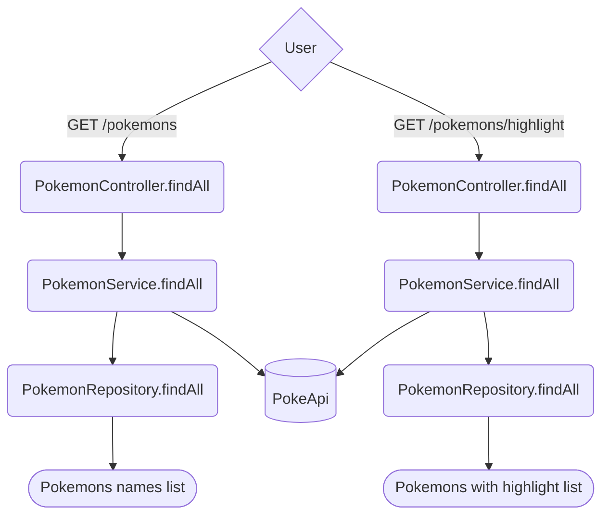

# PokeAPI Consumer Microservice
This microservice is designed to consume the PokeAPI and provide information about Pokémon. It exposes two endpoints: /pokemons and /pokemons/highlight, allowing users to retrieve Pokémon data. Additionally, both endpoints accept optional request parameters for sorting and querying.

## Endpoints

## GET /pokemons
This endpoint retrieves a list of Pokémon based on optional parameters and returns the data in the response.

**Optional Request Parameters:**

sort (string): Specifies the sorting order of the Pokémon list. Valid values are length or alphabetical.

query (string): Filters the Pokémon list based on a search query.

**Example Request:**
```GET /pokemons?sort=length&query=pikachu``` 

**Example Response:**
```JSON
{
    "result": [
        "pidgey",
        "pidgeotto",
        "pidgeot"
    ]
}
```

## GET /pokemons/highlight
This endpoint retrieves a list of Pokémon based on optional parameters and returns the data in the response.
Alongside the pokémon name, the response also has a highlight, the substring that matched the pokémon name.

**Optional Request Parameters:**

sort (string): Specifies the sorting order of the Pokémon list. Valid values are length or alphabetical.

query (string): Filters the Pokémon list based on a search query.

**Example Request:**
```GET /pokemons/highlight?sort=alphabetical&query=legendary``` 

**Example Response:**
```JSON
{
    "result": [
        {
        "name": "pichu",
        "highlight": "<pre>pi</pre>chu"
        },
        {
            "name": "pikachu",
            "highlight": "<pre>pi</pre>kachu"
        }
    ]
}
``` 

## Sort Algorithm
The sort method chosen is Merge Sort.
It has **O(n log n)** in all the cases.

**How it works**

Divide array into sublists, until they have only one element.
After it, merge the sublists, producing one sorted array

## Api Diagram
